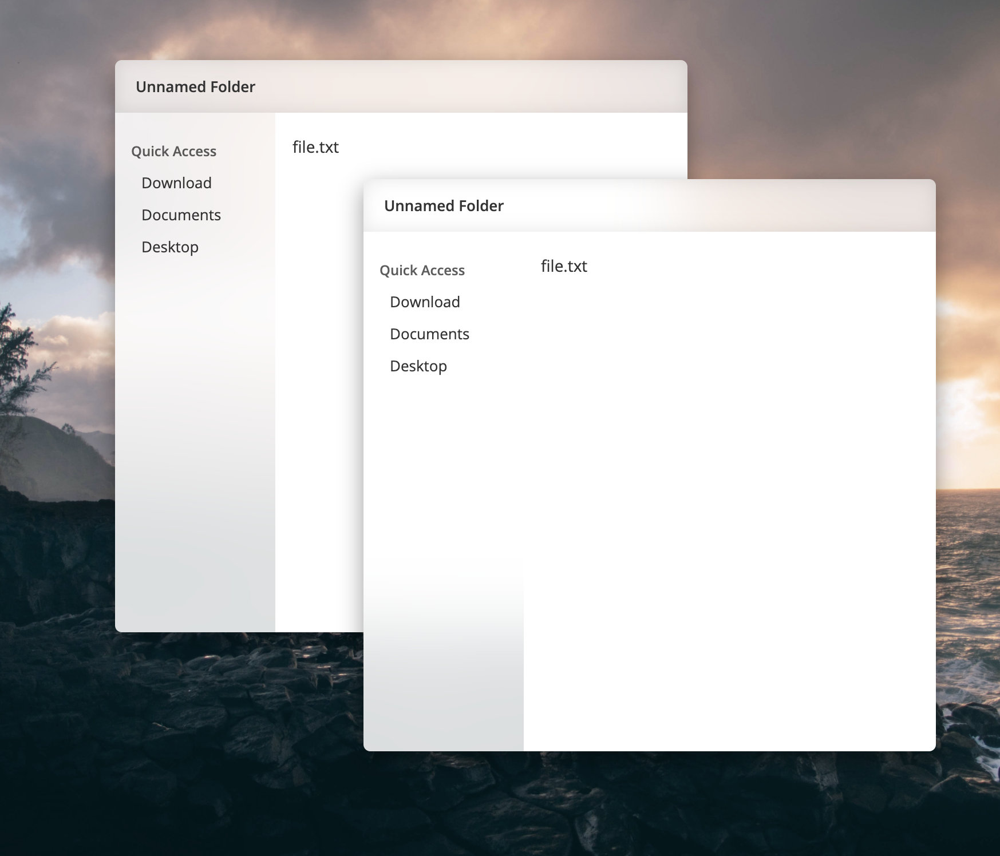

# UI-MGR

Trying to imitate desktop OS's UI with simple CSS+JS

Ever heard of **Interface Manager** or **Program Manager**? 

That was a thing. You might have used an evolved version of it. I got the name from it. And I started this because I saw its latest preview (2021).

Try it: https://fungnoth.github.io/ui-mgr/

Wallpaper from: https://unsplash.com/photos/lGCfApDzhYw

### Known Issues

- Nothing works besides **Dragging** and **Resizing windows**
- **Window Resize** doesn't work as expected unless you drag the bottom right corner.  
Will not be fixed until I suddenly feel like doing Maths. 